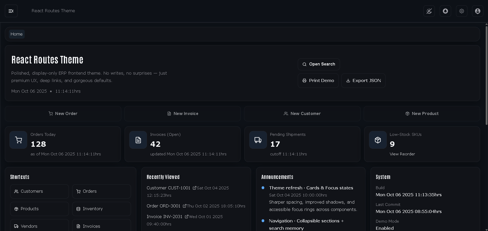

# react-routes-theme



Display-only, premium React routing/theme scaffold with **collapsible nav**, **manual routes**, and **GH Pages** support.

**Live:** https://a2rp.github.io/react-routes-theme/home  
**GitHub:** https://github.com/a2rp/react-routes-theme

---

## About Project

React Routes Theme is a routing-first starter for clean, demo-ready frontends. It keeps the surface polished and the internals simple so you can ship a credible preview without wrestling infra.

### What you get

-   **Explicit routes, lazy pages:** predictable links, fast splits, no surprises.
-   **Sidebar from your paths:** collapsible, searchable, keyboard-friendly.
-   **Breadcrumbs that mirror URLs:** tidy context with sensible fallbacks.
-   **Display-only safety:** fixtures for data, deep links for detail pages, demo-gated write actions.
-   **Built-ins that matter:** a small confirm modal and section-only print for clean PDFs.
-   **Token-first styling:** CSS variables, dark/light themes, restrained blue accent.
-   **GH Pages friendly:** base/basename wired + SPA 404 for reliable deep links.

### What you won’t fight

-   No heavy UI framework to unlearn - just sensible defaults.
-   No backend wiring for demos - fixtures keep it deterministic.
-   No browser alerts - only custom, styled dialogs.

> Shortcuts: **Ctrl + K** to search routes. On the Invoice page, press **P** to print.  
> Print template: `/print/invoice/INV-2031`

---

## Clone & Run

```bash
git clone https://github.com/a2rp/react-routes-theme.git
cd react-routes-theme
npm i
npm run dev
```
