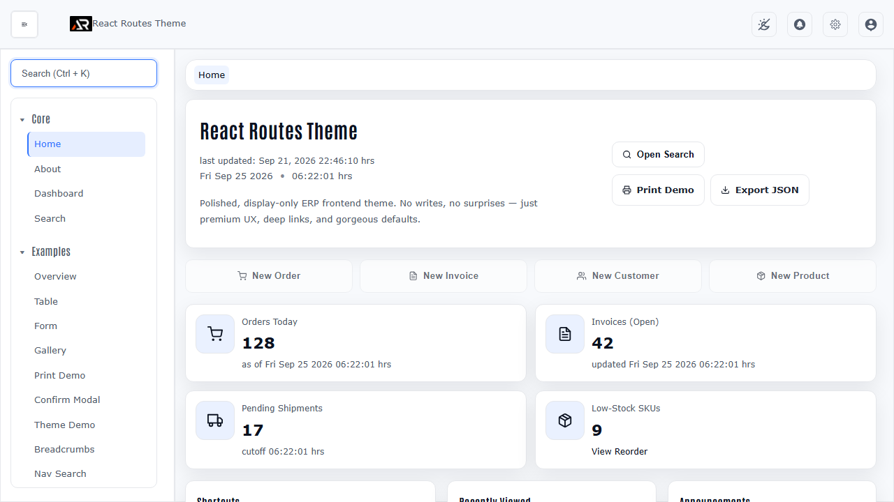

# React Routes Theme

A display-only React routing and theme showcase with a searchable sidebar, deep-link pages, reusable layouts, and a large set of business interface examples.

## Features

- Lazy-loaded route catalog with deep links
- Searchable and collapsible sidebar navigation
- Dark and light theme support
- Breadcrumbs, print helpers, modals, tables, forms, and dashboard screens
- Responsive fixed header with independently scrolling navigation
- Static fixtures for safe frontend exploration

## Tech stack

React, Vite, React Router, Material UI, styled-components, and React Icons.

## Run locally

``bash
npm install
npm run dev
``

## Build and deploy

``bash
npm run lint
npm run build
npm run deploy
``

Live demo: [a2rp.github.io/react-routes-theme](https://a2rp.github.io/react-routes-theme/)

Future improvements can connect the display screens to real services and shared data sources.

## Links

- Portfolio: [ashishranjan.net](https://www.ashishranjan.net/)
- GitHub: [github.com/a2rp](https://github.com/a2rp)
- CodePen: [codepen.io/ash1198](https://codepen.io/ash1198)
- LinkedIn: [linkedin.com/in/aashishranjan](https://www.linkedin.com/in/aashishranjan)
- Facebook: [facebook.com/theash.ashish](https://www.facebook.com/theash.ashish/)
- YouTube: [youtube.com/@ashishranjan-ashz](https://www.youtube.com/@ashishranjan-ashz?sub_confirmation=1)
- Email: [ash.ranjan09@gmail.com](mailto:ash.ranjan09@gmail.com)

## Support

- [Support](https://a2rp-donation-page.netlify.app/)
- [Buy Me a Coffee](https://buymeacoffee.com/a2rp)
- [Patreon](https://www.patreon.com/a2rp)